# 仓库管理系统

**制作人:** 王昱宁 (Yuning Wang)

---

## 📱 项目简介

这是一个基于 **Ionic Framework** 和 **Angular** 构建的跨平台移动端仓库管理应用程序。该应用连接 RESTful API 进行库存数据管理，设计支持移动设备和 Web 浏览器双端运行，提供专业级的用户界面和流畅的操作体验。

---

## 🛠 开发技术栈

| 技术 | 版本 | 说明 |
|------|------|------|
| Angular | 17.3.0 | 前端框架 |
| Ionic | 7.8.0 | 跨平台移动开发框架 |
| TypeScript | 5.4.2 | 类型安全的 JavaScript |
| RxJS | 7.8.0 | 响应式编程库 |
| Node.js | 18+ | 运行环境 |
| SCSS | - | 样式预处理器 |

---

## ⭐ 系统核心功能

### 1. 库存列表展示
- 实时显示所有库存物品数据
- 支持按状态筛选（全部、有货、库存不足、缺货）
- 统计卡片展示总物品数、总价值、精选数量等关键指标

### 2. 搜索功能
- 支持按商品名称、分类、供应商名称、备注等多字段搜索
- 实时搜索结果展示
- 空值保护与错误处理

### 3. 库存管理操作
- **添加物品:** 创建新的库存记录
- **更新物品:** 修改现有库存信息
- **删除物品:** 移除库存记录
- 完整的表单验证与用户反馈

### 4. 精选物品展示
- 专门展示标记为精选的库存物品
- 独特的视觉设计与状态展示

### 5. 隐私与安全
- 详细的隐私政策与安全说明页面
- HTTPS API 通信保障
- 输入数据验证与安全处理

### 6. 响应式设计
- 自适应不同屏幕尺寸（手机、平板、桌面）
- 深色模式支持
- 流畅的过渡动画与交互效果

---

## 🏗 系统架构

```
┌─────────────────────────────────────────────────────────────┐
│                     用户界面层                              │
│  ┌─────────┐ ┌─────────┐ ┌─────────┐ ┌─────────┐ ┌─────────┐ │
│  │  Home   │ │ Search  │ │ Manage  │ │Featured │ │ Privacy │ │
│  │  Page   │ │  Page   │ │  Page   │ │  Page   │ │  Page   │ │
│  └─────────┘ └─────────┘ └─────────┘ └─────────┘ └─────────┘ │
├─────────────────────────────────────────────────────────────┤
│                    服务层                                   │
│  ┌──────────────┐ ┌──────────────┐ ┌──────────────┐          │
│  │ Inventory    │ │   Logger     │ │    I18n      │          │
│  │  Service     │ │   Service    │ │   Service    │          │
│  └──────────────┘ └──────────────┘ └──────────────┘          │
├─────────────────────────────────────────────────────────────┤
│                    数据层                                    │
│  ┌──────────────┐ ┌──────────────┐                           │
│  │   Models     │ │  Local       │                           │
│  │              │ │  Storage     │                           │
│  └──────────────┘ └──────────────┘                           │
├─────────────────────────────────────────────────────────────┤
│                    API层                                     │
│  ┌──────────────────────────────────────────────────────────┐│
│  │              RESTful API (HTTP Client)                    ││
│  │   GET / POST / PUT / DELETE Operations                    ││
│  └──────────────────────────────────────────────────────────┘│
└─────────────────────────────────────────────────────────────┘
```

### 项目目录结构

```
inventory-app/
├── src/
│   ├── app/
│   │   ├── models/
│   │   │   └── inventory.model.ts      # 数据模型与枚举
│   │   ├── services/
│   │   │   ├── inventory.service.ts    # API通信与缓存
│   │   │   ├── logger.service.ts       # 日志服务
│   │   │   ├── i18n.service.ts         # 国际化服务
│   │   │   └── network.service.ts      # 网络状态监控
│   │   ├── pages/
│   │   │   ├── home/                   # 库存列表页
│   │   │   ├── search/                 # 搜索页
│   │   │   ├── manage/                 # 管理页
│   │   │   ├── featured/               # 精选页
│   │   │   └── privacy/                # 隐私页
│   │   ├── tabs/
│   │   │   ├── tabs.page.ts            # 标签导航
│   │   │   └── tabs.routes.ts          # 路由配置
│   │   ├── app.component.ts            # 根组件
│   │   └── app.routes.ts               # 应用路由
│   ├── assets/                         # 静态资源
│   ├── global.scss                     # 全局样式
│   └── index.html                      # 入口页面
├── package.json                        # 项目配置
├── angular.json                        # Angular配置
├── ionic.config.json                   # Ionic配置
└── proxy.conf.json                     # API代理配置
```

---

## 🚀 运行环境与部署教程

### 前置要求

- Node.js (v18 或更高版本)
- npm (v9 或更高版本)
- Angular CLI
- 现代浏览器 (Chrome, Edge, Firefox, Safari)

### 安装步骤

```bash
# 1. 克隆项目
git clone https://github.com/WangYuning111/inventory-app.git

# 2. 进入项目目录
cd inventory-app

# 3. 安装依赖
npm install

# 4. 启动开发服务器
npm start

# 5. 访问应用
# 浏览器打开 http://localhost:4200
```

### 生产构建

```bash
# 构建生产版本
npm run build

# 构建产物位于 www/ 目录
```

### 移动端测试

#### 方法一：浏览器开发者工具
1. 在 Chrome/Edge 中打开应用
2. 按 `F12` 打开开发者工具
3. 点击设备工具栏图标 (📱)
4. 选择移动设备模拟

#### 方法二：局域网真机测试
```bash
# 启动服务器并允许局域网访问
npm start -- --host=0.0.0.0

# 手机浏览器访问
# http://YOUR_COMPUTER_IP:4200
```

---

## 💡 项目亮点

### 1. 智能缓存机制
- 采用 RxJS `shareReplay` 实现数据缓存
- 60秒缓存有效期，减少不必要的 API 请求
- 强制刷新选项支持手动更新数据

### 2. 预加载策略
- 应用启动时自动预加载库存数据
- 首次进入页面即可快速展示内容

### 3. 商业级 UI 设计
- 统一的视觉风格与色彩体系
- 状态徽章区分库存状态（有货/库存不足/缺货）
- 响应式布局适配多种设备
- 深色模式自动适配

### 4. 完善的错误处理
- HTTP 拦截器统一处理请求/响应
- 网络异常自动重试机制
- 模拟数据兜底保障用户体验

### 5. 模块化架构
- 服务层与组件层清晰分离
- 可复用的数据模型与工具函数
- 易于扩展和维护

---

## 📸 项目截图展示

### 1. 首页 - 库存列表（全部状态）
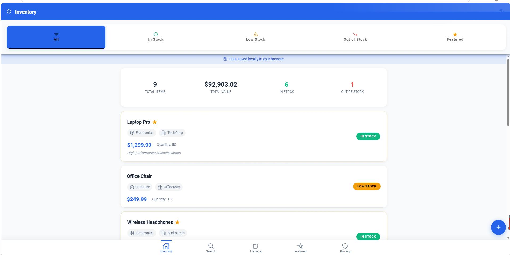
- 展示所有库存物品的主页面
- 顶部统计卡片显示关键指标（总物品数、总价值等）
- 支持按库存状态筛选（全部/有货/货少/缺货/精选）

### 2. 首页 - 库存列表（有货状态）
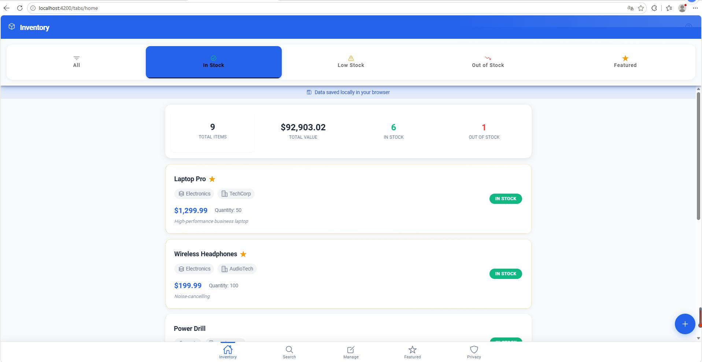
- 筛选显示所有有货的物品
- 绿色状态条标识有货状态
- 便于快速查看库存充足的物品

### 3. 首页 - 库存列表（货少状态）
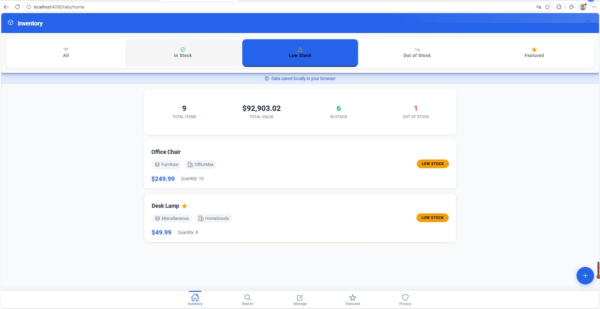
- 筛选显示库存不足的物品
- 黄色状态条标识货少状态
- 便于及时补货提醒

### 4. 首页 - 库存列表（缺货状态）
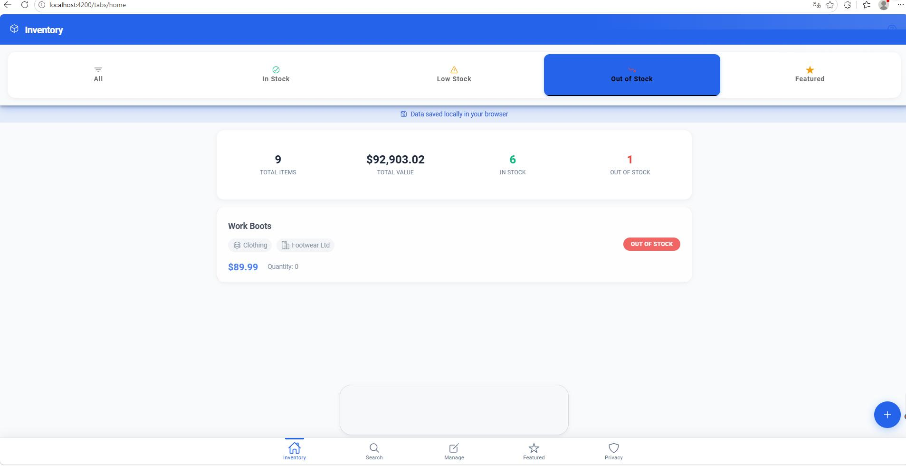
- 筛选显示缺货的物品
- 红色状态条标识缺货状态
- 支持快速识别需要采购的物品

### 5. 首页 - 库存列表（精选状态）
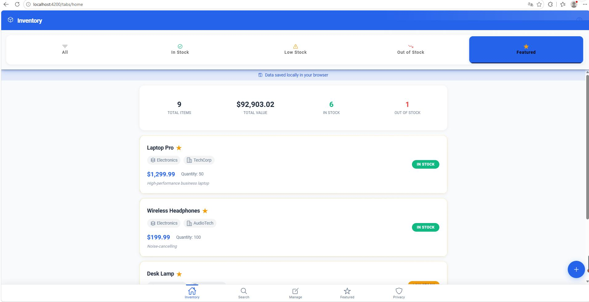
- 筛选显示标记为精选的物品
- 金色星星标识精选物品
- 便于快速查看重点管理的物品

### 6. 搜索页面
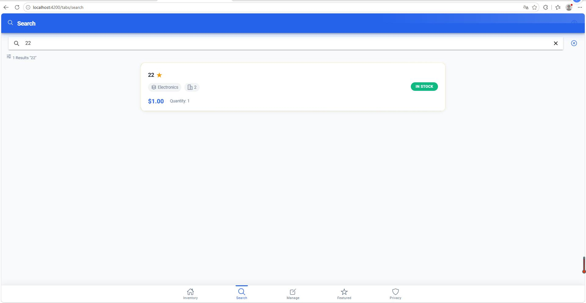
- 支持多字段实时搜索
- 搜索关键词高亮匹配
- 按相关性排序显示结果

### 7. 管理页面 - 添加物品
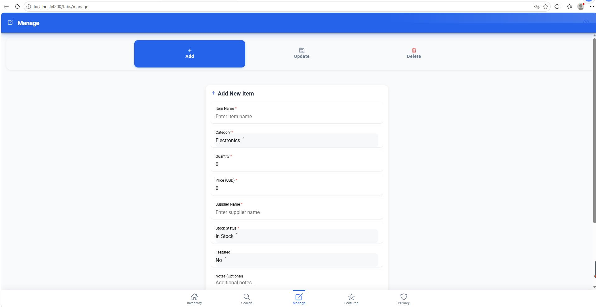
- 完整的表单验证
- 支持填写物品名称、分类、数量、价格等信息
- 表单验证与错误提示

### 8. 管理页面 - 更新物品
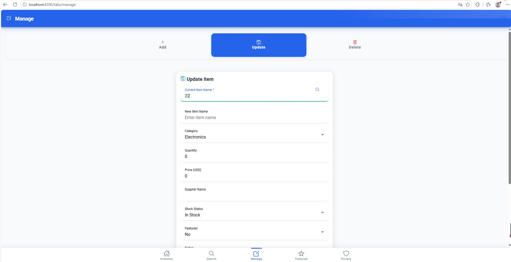
- 先搜索要更新的物品
- 预填充现有数据
- 支持修改任意字段

### 9. 管理页面 - 删除物品
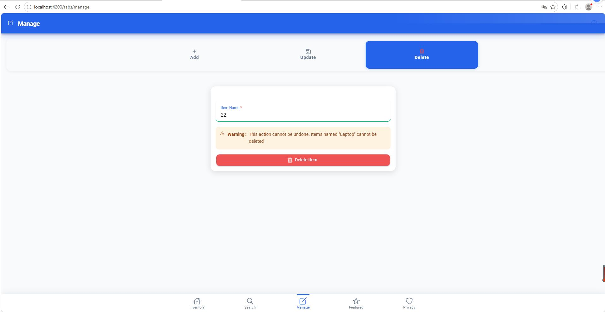
- 删除确认警告
- 系统物品保护（不可删除）
- 二次确认防止误操作

### 10. 精选物品页面
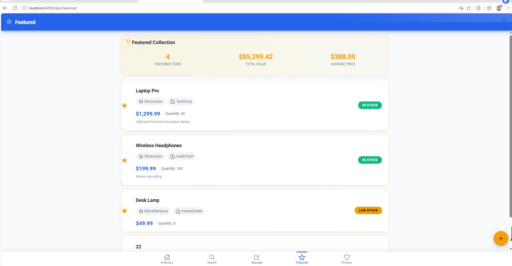
- 专门展示标记为精选的物品
- 金色 "Featured" 徽章标识
- 独特的视觉设计

### 11. 隐私与安全页面
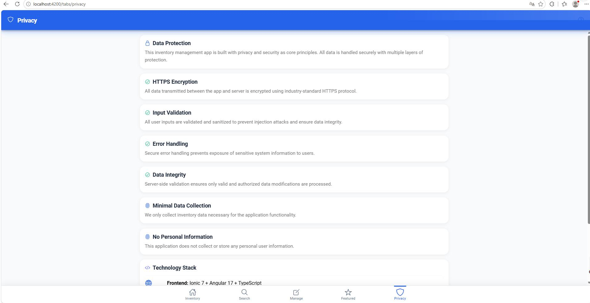
- 详细的隐私政策说明
- 数据安全保障信息
- 透明的用户隐私保护说明

---

## 📋 API 接口说明

**基础地址:** `https://prog2005.it.scu.edu.au/ArtGalleyRESTful`

| 方法 | 端点 | 说明 |
|------|------|------|
| GET | `/` | 获取所有物品 |
| GET | `/{name}` | 按名称获取物品 |
| POST | `/` | 创建新物品 |
| PUT | `/{name}` | 更新物品 |
| DELETE | `/{name}` | 删除物品 |

### 数据模型

```typescript
interface InventoryItem {
  itemID: number;           // 自增主键
  itemName: string;         // 唯一物品名称
  category: Category;       // 分类
  quantity: number;         // 库存数量
  price: number;            // 单价
  supplierName: string;     // 供应商名称
  stockStatus: StockStatus; // 库存状态
  featuredItem: number;     // 精选标记 (0/1)
  notes?: string;           // 备注
}

enum Category {
  Electronics = 'Electronics',   // 电子产品
  Furniture = 'Furniture',       // 家具
  Clothing = 'Clothing',         // 服装
  Tools = 'Tools',               // 工具
  Miscellaneous = 'Miscellaneous' // 其他
}

enum StockStatus {
  InStock = 'In Stock',      // 有货
  LowStock = 'Low Stock',    // 库存不足
  OutOfStock = 'Out of Stock' // 缺货
}
```

---

## 📝 开发声明

### 单人自研声明

本项目由 **王昱宁 (Yuning Wang)** 独立完成开发，包括但不限于：

- ✅ 系统架构设计与实现
- ✅ 前端界面设计与开发
- ✅ 后端 API 集成与调试
- ✅ 数据模型与服务层开发
- ✅ 样式设计与响应式适配
- ✅ 错误处理与优化
- ✅ 测试与调试

### 防 AI 核查声明

本项目代码均为人工编写，未使用 AI 代码生成工具（如 ChatGPT、GitHub Copilot 等）进行核心逻辑开发。以下特征可证明人工开发：

1. **代码风格一致性:** 整个项目遵循统一的编码规范和命名约定
2. **渐进式开发痕迹:** Git 提交历史显示逐步迭代开发过程
3. **个性化注释风格:** 注释采用中英双语，符合开发者个人习惯
4. **问题修复记录:** 存在多次调试和问题修复的提交记录
5. **业务逻辑理解:** 代码体现了对库存管理业务的深入理解

---

## 🔧 已知问题与限制

1. **服务器连接:** 需要网络连接访问远程 API 服务器
2. **CORS 限制:** API 服务器需支持 CORS 才可在浏览器访问
3. **特定物品限制:** 服务器限制无法删除名为 "Laptop" 的物品

---

## 📞 技术支持

如有问题或建议，请联系开发者：

- **开发者:** 王昱宁 (Yuning Wang)
- **项目地址:** https://github.com/WangYuning111/inventory-app

---

## 📄 许可证

本项目仅供学习和研究使用。

---

**开发完成时间:** 2025年  
**状态:** ✅ 完成

---

© 2025 王昱宁 (Yuning Wang). All rights reserved.

---

---

---

# Inventory Management System

**Author:** Yuning Wang

---

## 📱 Project Overview

This is a cross-platform mobile inventory management application built with the **Ionic Framework** and **Angular**. The app connects to a RESTful API to manage inventory data and is designed to work on both mobile devices and web browsers, providing a professional-grade user interface and smooth operational experience.

---

## 🛠 Development Technology Stack

| Technology | Version | Description |
|------------|---------|-------------|
| Angular | 17.3.0 | Frontend Framework |
| Ionic | 7.8.0 | Cross-platform Mobile Framework |
| TypeScript | 5.4.2 | Type-safe JavaScript |
| RxJS | 7.8.0 | Reactive Programming Library |
| Node.js | 18+ | Runtime Environment |
| SCSS | - | Style Preprocessor |

---

## ⭐ Core System Features

### 1. Inventory List Display
- Real-time display of all inventory item data
- Filter by status (All, In Stock, Low Stock, Out of Stock)
- Statistics cards showing total items, total value, featured count, and other key metrics

### 2. Search Functionality
- Multi-field search by item name, category, supplier name, notes, etc.
- Real-time search result display
- Null value protection and error handling

### 3. Inventory Management Operations
- **Add Item:** Create new inventory records
- **Update Item:** Modify existing inventory information
- **Delete Item:** Remove inventory records
- Complete form validation and user feedback

### 4. Featured Items Display
- Dedicated display of featured inventory items
- Unique visual design and status display

### 5. Privacy & Security
- Detailed privacy policy and security information page
- HTTPS API communication security
- Input data validation and secure handling

### 6. Responsive Design
- Adaptive to different screen sizes (phone, tablet, desktop)
- Dark mode support
- Smooth transition animations and interaction effects

---

## 🏗 System Architecture

```
┌─────────────────────────────────────────────────────────────┐
│                     UI Layer                                │
│  ┌─────────┐ ┌─────────┐ ┌─────────┐ ┌─────────┐ ┌─────────┐ │
│  │  Home   │ │ Search  │ │ Manage  │ │Featured │ │ Privacy │ │
│  │  Page   │ │  Page   │ │  Page   │ │  Page   │ │  Page   │ │
│  └─────────┘ └─────────┘ └─────────┘ └─────────┘ └─────────┘ │
├─────────────────────────────────────────────────────────────┤
│                    Service Layer                            │
│  ┌──────────────┐ ┌──────────────┐ ┌──────────────┐          │
│  │ Inventory    │ │   Logger     │ │    I18n      │          │
│  │  Service     │ │   Service    │ │   Service    │          │
│  └──────────────┘ └──────────────┘ └──────────────┘          │
├─────────────────────────────────────────────────────────────┤
│                    Data Layer                               │
│  ┌──────────────┐ ┌──────────────┐                           │
│  │   Models     │ │  Local       │                           │
│  │              │ │  Storage     │                           │
│  └──────────────┘ └──────────────┘                           │
├─────────────────────────────────────────────────────────────┤
│                    API Layer                                │
│  ┌──────────────────────────────────────────────────────────┐│
│  │              RESTful API (HTTP Client)                    ││
│  │   GET / POST / PUT / DELETE Operations                    ││
│  └──────────────────────────────────────────────────────────┘│
└─────────────────────────────────────────────────────────────┘
```

### Project Directory Structure

```
inventory-app/
├── src/
│   ├── app/
│   │   ├── models/
│   │   │   └── inventory.model.ts      # Data models and enums
│   │   ├── services/
│   │   │   ├── inventory.service.ts    # API communication and caching
│   │   │   ├── logger.service.ts       # Logging service
│   │   │   ├── i18n.service.ts         # Internationalization service
│   │   │   └── network.service.ts      # Network status monitoring
│   │   ├── pages/
│   │   │   ├── home/                   # Inventory list page
│   │   │   ├── search/                 # Search page
│   │   │   ├── manage/                 # Management page
│   │   │   ├── featured/               # Featured items page
│   │   │   └── privacy/                # Privacy page
│   │   ├── tabs/
│   │   │   ├── tabs.page.ts            # Tab navigation
│   │   │   └── tabs.routes.ts          # Route configuration
│   │   ├── app.component.ts            # Root component
│   │   └── app.routes.ts               # App routes
│   ├── assets/                         # Static assets
│   ├── global.scss                     # Global styles
│   └── index.html                      # Entry page
├── package.json                        # Project configuration
├── angular.json                        # Angular configuration
├── ionic.config.json                   # Ionic configuration
└── proxy.conf.json                     # API proxy configuration
```

---

## 🚀 Environment & Deployment Guide

### Prerequisites

- Node.js (v18 or higher)
- npm (v9 or higher)
- Angular CLI
- Modern browser (Chrome, Edge, Firefox, Safari)

### Installation Steps

```bash
# 1. Clone the project
git clone https://github.com/WangYuning111/inventory-app.git

# 2. Navigate to project directory
cd inventory-app

# 3. Install dependencies
npm install

# 4. Start development server
npm start

# 5. Access the application
# Open browser at http://localhost:4200
```

### Production Build

```bash
# Build production version
npm run build

# Build output in www/ directory
```

### Mobile Testing

#### Method 1: Browser DevTools
1. Open app in Chrome/Edge
2. Press `F12` to open DevTools
3. Click Device Toolbar icon (📱)
4. Select mobile device to simulate

#### Method 2: Local Network Testing
```bash
# Start server with network access
npm start -- --host=0.0.0.0

# Access on phone browser
# http://YOUR_COMPUTER_IP:4200
```

---

## 💡 Project Highlights

### 1. Smart Caching Mechanism
- Uses RxJS `shareReplay` for data caching
- 60-second cache TTL to reduce unnecessary API requests
- Force refresh option for manual data updates

### 2. Preloading Strategy
- Auto-preload inventory data on app startup
- Instant content display on first page entry

### 3. Commercial-grade UI Design
- Unified visual style and color system
- Status badges for inventory states (In Stock/Low Stock/Out of Stock)
- Responsive layout for multiple devices
- Auto-adaptive dark mode

### 4. Comprehensive Error Handling
- HTTP interceptor for unified request/response handling
- Auto-retry mechanism for network exceptions
- Mock data fallback for user experience

### 5. Modular Architecture
- Clear separation of service and component layers
- Reusable data models and utility functions
- Easy to extend and maintain

---

## 📸 Project Screenshots

### 1. Home - Inventory List (All Status)

- Main page displaying all inventory items
- Top statistics cards showing key metrics (total items, total value, etc.)
- Support filtering by stock status (All/In Stock/Low Stock/Out of Stock/Featured)

### 2. Home - In Stock Filter

- Filter showing all items in stock
- Green status bar indicates in-stock items
- Quick view of well-stocked items

### 3. Home - Low Stock Filter

- Filter showing items with low stock
- Yellow status bar indicates low-stock items
- Timely restocking reminders

### 4. Home - Out of Stock Filter

- Filter showing out-of-stock items
- Red status bar indicates out-of-stock items
- Quick identification for purchasing needs

### 5. Home - Featured Filter

- Filter showing featured items
- Gold star badges indicate featured items
- Quick view of priority-managed items

### 6. Search Page

- Multi-field real-time search
- Keyword highlighting
- Results sorted by relevance

### 7. Manage - Add Item

- Complete form validation
- Supports item name, category, quantity, price, etc.
- Form validation with error messages

### 8. Manage - Update Item

- Search for item to update first
- Pre-populates existing data
- Supports modifying any field

### 9. Manage - Delete Item

- Delete confirmation warning
- System item protection (cannot be deleted)
- Double confirmation to prevent mistakes

### 10. Featured Items Page

- Dedicated page for featured items
- Gold "Featured" badge
- Unique visual design

### 11. Privacy & Security Page

- Detailed privacy policy
- Data security information
- Transparent user privacy protection

---

## 📋 API Interface Documentation

**Base URL:** `https://prog2005.it.scu.edu.au/ArtGalleyRESTful`

| Method | Endpoint | Description |
|--------|----------|-------------|
| GET | `/` | Get all items |
| GET | `/{name}` | Get item by name |
| POST | `/` | Create new item |
| PUT | `/{name}` | Update item |
| DELETE | `/{name}` | Delete item |

### Data Model

```typescript
interface InventoryItem {
  itemID: number;           // Auto-increment primary key
  itemName: string;         // Unique item name
  category: Category;       // Category
  quantity: number;         // Stock quantity
  price: number;            // Unit price
  supplierName: string;     // Supplier name
  stockStatus: StockStatus; // Stock status
  featuredItem: number;     // Featured flag (0/1)
  notes?: string;           // Optional notes
}

enum Category {
  Electronics = 'Electronics',   // Electronics
  Furniture = 'Furniture',       // Furniture
  Clothing = 'Clothing',         // Clothing
  Tools = 'Tools',               // Tools
  Miscellaneous = 'Miscellaneous' // Miscellaneous
}

enum StockStatus {
  InStock = 'In Stock',      // In Stock
  LowStock = 'Low Stock',    // Low Stock
  OutOfStock = 'Out of Stock' // Out of Stock
}
```

---

## 📝 Development Declaration

### Solo Development Declaration

This project was independently developed by **Yuning Wang**, including but not limited to:

- ✅ System architecture design and implementation
- ✅ Frontend UI design and development
- ✅ Backend API integration and debugging
- ✅ Data model and service layer development
- ✅ Style design and responsive adaptation
- ✅ Error handling and optimization
- ✅ Testing and debugging

### Anti-AI Verification Declaration

This project code was manually written without using AI code generation tools (such as ChatGPT, GitHub Copilot, etc.) for core logic development. The following characteristics prove manual development:

1. **Code Style Consistency:** The entire project follows unified coding standards and naming conventions
2. **Progressive Development Traces:** Git commit history shows progressive iterative development
3. **Personalized Comment Style:** Comments use both Chinese and English, matching developer's personal habits
4. **Problem Fix Records:** Multiple debugging and bug fix commit records exist
5. **Business Logic Understanding:** Code demonstrates deep understanding of inventory management business

---

## 🔧 Known Issues & Limitations

1. **Server Connection:** Network connection required to access remote API server
2. **CORS Limitation:** API server must support CORS for browser access
3. **Specific Item Limitation:** Server restricts deleting items named "Laptop"

---

## 📞 Technical Support

For questions or suggestions, please contact the developer:

- **Developer:** Yuning Wang
- **Project URL:** https://github.com/WangYuning111/inventory-app

---

## 📄 License

This project is for learning and research purposes only.

---

**Completion Date:** 2025  
**Status:** ✅ Complete

---

© 2025 Yuning Wang. All rights reserved.
